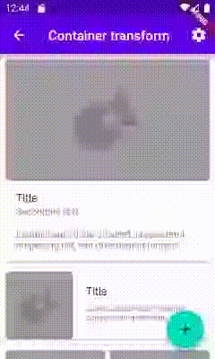
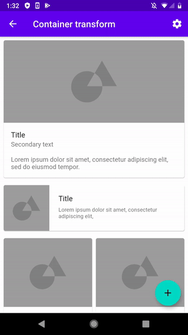
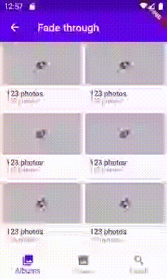
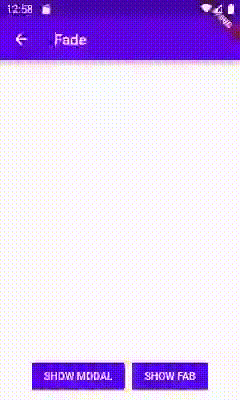

# Fancy pre-built Animations for Flutter

This package contains pre-canned animations for commonly-desired effects. The animations can be customized with your content and dropped into your application to delight your users.

To see examples of the following animations on a device or simulator:

```console
cd example/
flutter run --release
```

## Available Animations

Currently, the following animated effects are available in this library:

### Material's Open Container Transitions

Tapping on a container (e.g. a card or a button) will expand the container to reveal more information.

| Card with Fade Transition           |  Card with Fade Through Transition  |
:------------------------------------:|:------------------------------------:
||
| **Floating Action Button with Fade Transition**          |  **Floating Action Button with Fade Through Transition** |
||
### Material's Shared Axis Transitions

A transition animation between UI elements that have a spatial or navigational
relationship.

| Horizontal (x-axis)      |  Vertical (y-axis)      | Scaled (z-axis)      |
:-------------------------:|:-----------------------:|:--------------------:|
|||

### Material's Fade Through Transition

A transition animation between UI elements that have do not have a strong
relationship to one another.

| Fade Through Page Transition |
:-----------------------------:|
||

### Material's Fade Transition

The fade pattern is used for UI elements that enter or exit from within
the screen bounds.

| Modal Fade Transition             |  Floating Action Button Fade Transition |
:----------------------------------:|:----------------------------------------:
||
