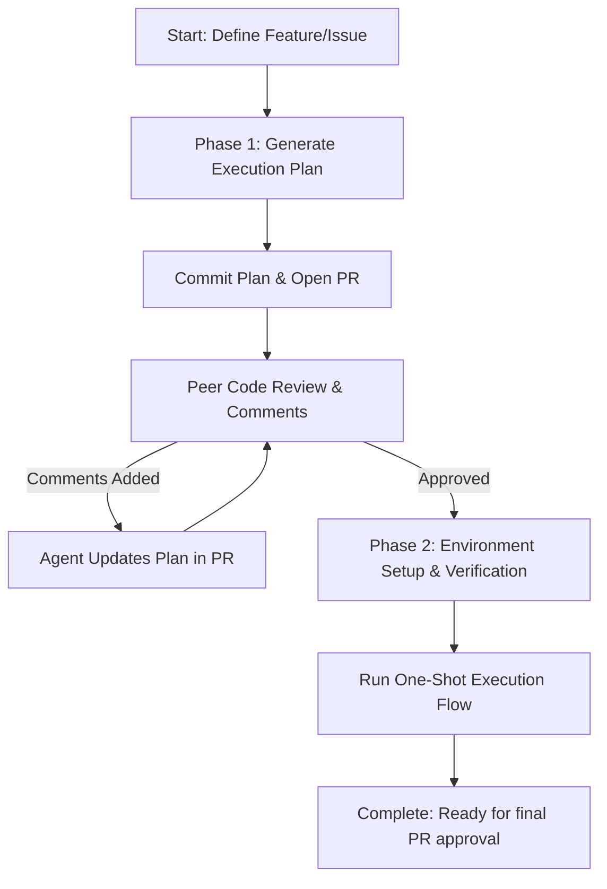

# Playbook: One-Shot Agentic Development Workflow

This playbook outlines the recommended workflow for humans to orchestrate agent-driven feature development. It is structured into two main phases: **Planning & Consensus** and **Phased Execution & Validation**.

---

## Phase 1: Planning & Consensus

The planning phase ensures the agent and human stakeholders align on the technical design and scope before any implementation begins.

### 1. Generating the Plan
* **Action:** Prompt the agent to analyze the requirements and write a detailed execution plan (`plan.md` or similar design artifact).
* **Tooling:** You can recommend the `/plan` or `/grill-me` slash commands to help generate and refine the plan iteratively.

### 2. PR-Based Consensus Loop
To gather consensus across multiple technical voices/reviewers:
1. **Commit and Push:** Commit the plan artifact to a git branch and open a Pull Request (PR).
2. **Review:** Human reviewers add comments directly on the plan in the PR.
3. **Iterative Updates:** The agent is responsible for reading the PR comments and updating the plan until all comments are addressed and the plan is approved.

> [!NOTE]
> Utilizing PRs for plan review is the most effective mechanism for achieving consensus on design decisions before modifying production code.

---

## Phase 2: Execution & Validation

Once the plan is approved, the workflow transitions to the execution phase.

### 1. Environment Verification
Before execution begins, the agent must validate that the environment is fully set up and in a clean, working state.
* **Pre-Flight Checks:** Run the repository diagnostics or readiness checks (such as the `check-readiness` skill) to verify toolchain versions, environment variables, and SDK configurations.
* **Clean State Check:** Run static analysis and basic tests on the unmodified branch to confirm that any existing failures are identified beforehand.

### 2. One-Shot Execution Flow
In this phase, the agent executes the approved plan using a specialized one-shot execution skill or subagent context.

At a high level, this execution flow focuses on:
1. **Targeted Code Modification:** Editing the codebase strictly within the bounds of the approved plan.
2. **Verification & Testing:** Running automated validation (linters, formatters, and unit/integration tests) to ensure the change functions correctly and does not introduce regressions.
