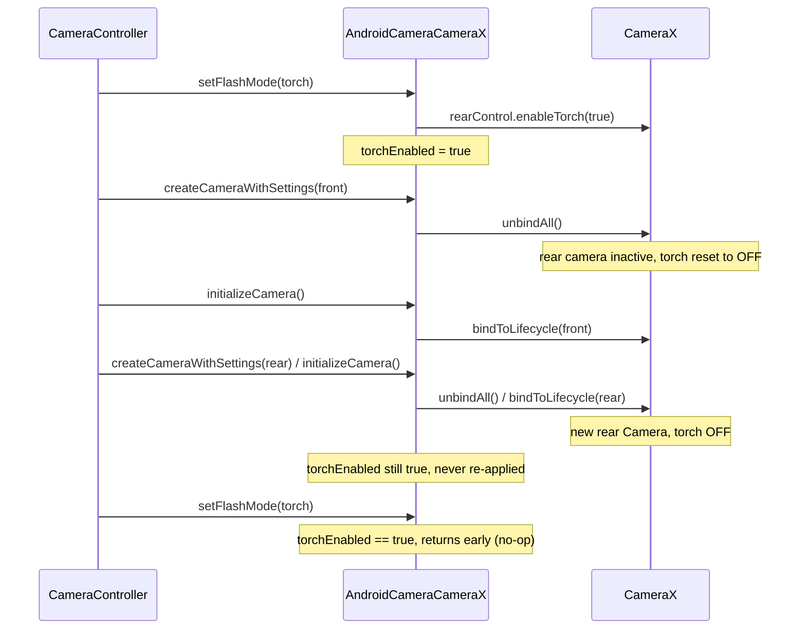

# Fix: torch doesn't keep its state across camera switches (`camera_android_camerax`)

## Background

Steps to reproduce (using [main.dart](file:///Users/camillesimon/packages/packages/camera/camera_android_camerax/example/lib/main.dart)):

1. Create and initialize the **rear** camera.
2. Turn on the torch with `CameraController.setFlashMode(FlashMode.torch)`.
3. Switch to the **front** camera (no flash unit). Don't turn the torch off.
4. Switch back to the **rear** camera.

**What should happen:** after step 4 the torch comes back on by itself. Calling `setFlashMode(FlashMode.torch)` again does nothing, because the torch is already on.
**What happens now:** the torch stays off after step 4, and calling `setFlashMode(FlashMode.torch)` doesn't turn it on.

---

## Root cause

The plugin keeps its own Dart-side record of whether the torch is on. CameraX resets the real torch whenever a camera goes inactive, and the plugin never updates its record to match.

### 1. The plugin stores torch state in one field

[`torchEnabled`](file:///Users/camillesimon/packages/packages/camera/camera_android_camerax/lib/src/android_camera_camerax.dart#L135-L137) is a field on the `AndroidCameraCameraX` singleton. It is only ever changed in [`setFlashMode`](file:///Users/camillesimon/packages/packages/camera/camera_android_camerax/lib/src/android_camera_camerax.dart#L1061-L1086), and that method **returns early when it thinks the torch is already on**:

```dart
case FlashMode.torch:
  _currentFlashMode = null;
  if (torchEnabled) {
    // Torch mode enabled already.
    return;                      // <-- the second tap in step 4 stops here
  }
  await _enableTorchMode(true);
  torchEnabled = true;
```

### 2. Switching cameras replaces the CameraX `Camera`, and CameraX turns the torch off

When the camera isn't recording, `CameraController.setDescription` calls `createCameraWithSettings` and then `initializeCamera` again ([camera_controller.dart#L617-L624](file:///Users/camillesimon/packages/packages/camera/camera_android_camerax/example/lib/camera_controller.dart#L617-L624), [#L277-L334](file:///Users/camillesimon/packages/packages/camera/camera_android_camerax/example/lib/camera_controller.dart#L277-L334)). The published `camera` package does the same thing.

- [`createCameraWithSettings`](file:///Users/camillesimon/packages/packages/camera/camera_android_camerax/lib/src/android_camera_camerax.dart#L402-L404) calls `processCameraProvider.unbindAll()`.
- [`initializeCamera`](file:///Users/camillesimon/packages/packages/camera/camera_android_camerax/lib/src/android_camera_camerax.dart#L478-L483) calls `bindToLifecycle(...)` with the new selector. That returns a new `Camera`, and [`_updateCameraInfoAndLiveCameraState`](file:///Users/camillesimon/packages/packages/camera/camera_android_camerax/lib/src/android_camera_camerax.dart#L1454-L1460) then swaps in the new `cameraInfo` and `cameraControl`.

In CameraX, the torch belongs to one camera. When a camera goes inactive (for example, all its use cases are unbound), CameraX's `TorchControl` turns the torch off and sets `TorchState` to `OFF`. When you bind to a camera again, the torch starts **off**.

### 3. Neither `createCameraWithSettings` nor `initializeCamera` reads or resets `torchEnabled`

Neither method looks at `torchEnabled` ([create](file:///Users/camillesimon/packages/packages/camera/camera_android_camerax/lib/src/android_camera_camerax.dart#L366-L437), [initialize](file:///Users/camillesimon/packages/packages/camera/camera_android_camerax/lib/src/android_camera_camerax.dart#L452-L512)). So after step 4:

| | Dart (`torchEnabled`) | Hardware (CameraX `TorchState`) | App (`CameraValue.flashMode`) |
|---|---|---|---|
| After step 2 | `true` | ON | `torch` |
| After step 3 (front camera) | `true` | n/a (no flash) | `torch` |
| After step 4 (rear camera) | `true` | **OFF** | `torch` |
| Tap torch again | `true` → early return | **OFF** | `torch` |



### Related paths with the same problem
- **Switching cameras while recording:** [`setDescriptionWhileRecording`](file:///Users/camillesimon/packages/packages/camera/camera_android_camerax/lib/src/android_camera_camerax.dart#L950-L982) also calls `unbindAll()` and then `bindToLifecycle()`, so the torch is lost there too.
- **`dispose` followed by a new controller** (the example app does this in `didChangeAppLifecycleState`, [main.dart#L118-L127](file:///Users/camillesimon/packages/packages/camera/camera_android_camerax/example/lib/main.dart#L118-L127)): [`dispose`](file:///Users/camillesimon/packages/packages/camera/camera_android_camerax/lib/src/android_camera_camerax.dart#L516-L528) unbinds everything but leaves `torchEnabled == true`. The new `CameraController` starts with `flashMode: auto`, but tapping the torch does nothing (same early return).
- **Re-binding a single use case in [`_bindUseCaseToLifecycle`](file:///Users/camillesimon/packages/packages/camera/camera_android_camerax/lib/src/android_camera_camerax.dart#L1296-L1309)** (e.g. `resumePreview` when the preview was the only bound use case): if the camera had gone inactive, the torch is lost the same way.

> [!NOTE]
> This code has worked the same way since torch mode was added ("Implements torch flash mode" in the CHANGELOG). That fits the report that the bug appears on `camera: ^0.11.0+2` and probably earlier versions too.

---

## Proposed solution

Keep `torchEnabled` as the **requested** torch mode, which is how the app sees it: `CameraValue.flashMode` stays `torch` across `setDescription`. Then **apply that request again every time the plugin gets a new CameraX `Camera`**, skipping cameras that have no flash unit. Reset the request on `dispose`, because a new `CameraController` starts from default settings.

All camera (re)binding already goes through [`_updateCameraInfoAndLiveCameraState`](file:///Users/camillesimon/packages/packages/camera/camera_android_camerax/lib/src/android_camera_camerax.dart#L1454-L1460): `initializeCamera`, `setDescriptionWhileRecording`, and `_bindUseCaseToLifecycle` (used by `takePicture`, `resumePreview`, `startVideoCapturing` and image streaming). Putting the restore there covers every path in one place.

### Design decision: one torch value, not a map per camera
Devices can have more than one front and one back camera (for example rear wide, telephoto and ultrawide). We considered storing torch state per camera (`Map<String, bool>`). We chose to keep **one controller-level value**:

- **It matches the app-facing API.** `CameraValue.flashMode` is one value per `CameraController`, and it stays the same across `setDescription`. With a map, switching from a rear wide camera with the torch on to a rear telephoto camera would leave the torch **off** while the UI still shows `torch`. That's the same kind of mismatch this fix removes.
- **It matches the other flash modes.** [`_currentFlashMode`](file:///Users/camillesimon/packages/packages/camera/camera_android_camerax/lib/src/android_camera_camerax.dart#L132-L133) (`off`/`auto`/`always`) is already one value, applied to whichever `ImageCapture` is active on [`takePicture`](file:///Users/camillesimon/packages/packages/camera/camera_android_camerax/lib/src/android_camera_camerax.dart#L1028-L1035).
- **It matches the hardware.** Rear lenses usually share one flash LED. Turning it off when switching between rear lenses would look like a bug.
- **It still handles any number of cameras.** The torch is restored on every camera where `hasFlashUnit == true`, and cameras without a flash are skipped. Unit test 7 covers this.

### Checking for a flash unit
The front camera usually has no flash unit. Calling CameraX `enableTorch` on it fails with `IllegalStateException("No flash unit")`. [`_enableTorchMode`](file:///Users/camillesimon/packages/packages/camera/camera_android_camerax/lib/src/android_camera_camerax.dart#L1816-L1822) would send that to `onCameraError`, and the example app shows it as a snackbar on every switch to the front camera. To avoid that, expose CameraX's [`CameraInfo.hasFlashUnit()`](https://developer.android.com/reference/androidx/camera/core/CameraInfo#hasFlashUnit()) and check it before restoring.

---

### Pigeon / native layer

#### [MODIFY] [camerax_library.dart (pigeons)](file:///Users/camillesimon/packages/packages/camera/camera_android_camerax/pigeons/camerax_library.dart#L228-L244)
```diff
 abstract class CameraInfo {
   /// Returns the sensor rotation in degrees, relative to the device's "natural"
   /// (default) orientation.
   late int sensorRotationDegrees;

   /// Returns the lens direction of this camera.
   late LensFacing lensFacing;

   /// Returns a ExposureState.
   late ExposureState exposureState;
+
+  /// Returns whether or not the camera has a flash unit.
+  late bool hasFlashUnit;
```
Then run `dart run pigeon --input pigeons/camerax_library.dart`. This regenerates `lib/src/camerax_library.g.dart` and the Kotlin `CameraXLibrary.g.kt`. Nothing in the repo calls `CameraInfo.pigeon_detached(...)` directly, so the new required field doesn't break any existing code.

#### [MODIFY] [CameraInfoProxyApi.java](file:///Users/camillesimon/packages/packages/camera/camera_android_camerax/android/src/main/java/io/flutter/plugins/camerax/CameraInfoProxyApi.java)
```java
  @Override
  public boolean hasFlashUnit(CameraInfo pigeonInstance) {
    return pigeonInstance.hasFlashUnit();
  }
```

---

### Dart plugin

#### [MODIFY] [android_camera_camerax.dart](file:///Users/camillesimon/packages/packages/camera/camera_android_camerax/lib/src/android_camera_camerax.dart)

**(a) Restore the torch whenever the camera changes** ([L1454-L1460](file:///Users/camillesimon/packages/packages/camera/camera_android_camerax/lib/src/android_camera_camerax.dart#L1454-L1460)):
```diff
   Future<void> _updateCameraInfoAndLiveCameraState(int cameraId) async {
     cameraInfo = (await camera!.getCameraInfo()) as CameraInfo;
     cameraControl = camera!.cameraControl;
     await liveCameraState?.removeObservers();
     liveCameraState = await cameraInfo!.getCameraState();
     await liveCameraState!.observe(_createCameraClosingObserver(cameraId));
+    await _restoreTorchModeIfEnabled();
   }
+
+  /// Re-enables the torch on the current [camera] if torch mode was requested
+  /// via [setFlashMode].
+  ///
+  /// CameraX turns the torch off whenever a camera becomes inactive (e.g. when
+  /// all use cases are unbound to switch cameras), but the requested flash mode
+  /// should persist across camera switches. Cameras without a flash unit are
+  /// skipped so that switching to them does not report an error.
+  Future<void> _restoreTorchModeIfEnabled() async {
+    if (!torchEnabled || !cameraInfo!.hasFlashUnit) {
+      return;
+    }
+    await _enableTorchMode(true);
+  }
```
Calling `enableTorch(true)` again on a camera that already has the torch on does no harm. It is also rare: `_bindUseCaseToLifecycle` only reaches this code when the use case isn't bound yet.

**(b) Reset flash state on `dispose`** ([L516-L528](file:///Users/camillesimon/packages/packages/camera/camera_android_camerax/lib/src/android_camera_camerax.dart#L516-L528)):
```diff
     recording = null;
     pendingRecording = null;
     videoOutputPath = null;
+
+    // `processCameraProvider.unbindAll()` turns the torch off natively, and a
+    // subsequently created camera should start with default flash settings.
+    torchEnabled = false;
+    _currentFlashMode = null;
   }
```
Without (b), fix (a) would **silently turn the torch on** after the app resumes from the background, even though the new controller reports `flashMode: auto`.

`setFlashMode` itself doesn't change. After step 4, `torchEnabled == true` and the torch really is on, so the early return is now correct: calling torch again does nothing, which is the expected behavior.

---

### Package metadata
#### [MODIFY] [pubspec.yaml](file:///Users/camillesimon/packages/packages/camera/camera_android_camerax/pubspec.yaml) / [CHANGELOG.md](file:///Users/camillesimon/packages/packages/camera/camera_android_camerax/CHANGELOG.md)
`0.7.5` → `0.7.5+1`, created with `update-release-info --version=minimal`:
```
## 0.7.5+1

* Fixes torch mode not being retained after switching cameras.
```

---

## Testing plan

> [!IMPORTANT]
> All tests follow [TESTING.md](file:///Users/camillesimon/packages/packages/camera/camera_android_camerax/TESTING.md) and the `dart-add-unit-test` / `dart-generate-test-mocks` skills. `MockCameraInfo` / `MockCameraControl` already exist, so the only regeneration needed is `dart run build_runner build -d` after the pigeon change.

### 1. Dart unit tests: [android_camera_camerax_test.dart](file:///Users/camillesimon/packages/packages/camera/camera_android_camerax/test/android_camera_camerax_test.dart)

These go next to the existing flash tests ([L3547-L3659](file:///Users/camillesimon/packages/packages/camera/camera_android_camerax/test/android_camera_camerax_test.dart#L3547-L3659)). They use the same setup pattern as the `createCamera`/`initializeCamera` tests ([L907-L933](file:///Users/camillesimon/packages/packages/camera/camera_android_camerax/test/android_camera_camerax_test.dart#L907-L933)). Each camera switch returns a **different** `MockCamera` with its own `MockCameraInfo` (`hasFlashUnit` stubbed) and `MockCameraControl`. That mirrors CameraX giving back a new `Camera` for every bind.

| # | Test | What it checks |
|---|---|---|
| 1 | **Main regression test:** `torch mode is retained after switching from a camera with a flash unit to one without and back` | Runs steps 1–4 with `createCamera` + `initializeCamera`. Checks `rearControl2.enableTorch(true)` is called once, `frontControl.enableTorch(any)` is **never** called, no error is sent on `cameraErrorStreamController`, and `torchEnabled` stays `true`. Then `setFlashMode(torch)` makes no new `enableTorch` call, and `setFlashMode(off)` calls `rearControl2.enableTorch(false)`. |
| 2 | `initializeCamera does not enable torch when torch mode was not enabled` | `enableTorch` is never called after a switch when `torchEnabled == false`. |
| 3 | `initializeCamera does not enable torch on camera without flash unit` | With `hasFlashUnit == false`, `enableTorch` is never called and no error is sent. |
| 4 | `setDescriptionWhileRecording restores torch mode on new camera` | While recording, switching to a camera with a flash unit calls `enableTorch(true)` on the new control. |
| 5 | `resumePreview restores torch mode when rebinding the camera` | The `_bindUseCaseToLifecycle` path (`isBound → false`) calls `enableTorch(true)` on the new control. |
| 6 | `dispose resets torch mode` | After `setFlashMode(torch)` and `dispose`, `torchEnabled == false`. A later create + initialize doesn't call `enableTorch`, and a new `setFlashMode(torch)` **does** call `enableTorch(true)` (checks the second half of the bug via dispose). |
| 7 | `torch mode is restored when switching between multiple cameras with flash units` | Uses three or more cameras (e.g. rear A with flash, rear B with flash, front without flash). Switching A → front → B → A calls `enableTorch(true)` on each camera with a flash and never on the front camera. |

Sketch of test 1:
```dart
test('torch mode is retained after switching from a camera with a flash unit '
    'to one without and back', () async {
  final camera = AndroidCameraCameraX();
  final mockProcessCameraProvider = MockProcessCameraProvider();
  setUpOverridesForTestingUseCaseConfiguration(mockProcessCameraProvider);
  camera.processCameraProvider = mockProcessCameraProvider;

  MockCameraControl stubCamera({required bool hasFlashUnit}) { ... }
  final MockCameraControl rearControl1 = stubCamera(hasFlashUnit: true);
  final MockCameraControl frontControl = stubCamera(hasFlashUnit: false);
  final MockCameraControl rearControl2 = stubCamera(hasFlashUnit: true);
  // bindToLifecycle returns rear1, front, rear2 in order.

  final errors = <String>[];
  final StreamSubscription<String> sub =
      AndroidCameraCameraX.cameraErrorStreamController.stream.listen(errors.add);

  final int id = await camera.createCamera(rearDescription, null);
  await camera.initializeCamera(id);
  await camera.setFlashMode(id, FlashMode.torch);
  verify(rearControl1.enableTorch(true)).called(1);

  await camera.initializeCamera(await camera.createCamera(frontDescription, null));
  verifyNever(frontControl.enableTorch(any));

  await camera.initializeCamera(await camera.createCamera(rearDescription, null));
  verify(rearControl2.enableTorch(true)).called(1);
  expect(camera.torchEnabled, isTrue);

  await camera.setFlashMode(id, FlashMode.torch); // should be a no-op
  verifyNever(rearControl2.enableTorch(true));

  expect(errors, isEmpty);
  await sub.cancel();
});
```

Existing tests `setFlashMode turns on torch mode…` / `…turns off torch mode…` keep passing unchanged. With `GenerateNiceMocks`, `MockCameraInfo.hasFlashUnit` returns `false` by default, so current `initializeCamera` tests won't pick up unexpected `enableTorch` calls.

### 2. Native unit test: [CameraInfoTest.java](file:///Users/camillesimon/packages/packages/camera/camera_android_camerax/android/src/test/java/io/flutter/plugins/camerax/CameraInfoTest.java)
```java
@Test
public void hasFlashUnit_makesCallToRetrieveHasFlashUnit() {
  final PigeonApiCameraInfo api = new TestProxyApiRegistrar().getPigeonApiCameraInfo();
  final CameraInfo instance = mock(CameraInfo.class);
  when(instance.hasFlashUnit()).thenReturn(true);
  assertTrue(api.hasFlashUnit(instance));
}
```

### 3. Integration test: [integration_test.dart](file:///Users/camillesimon/packages/packages/camera/camera_android_camerax/example/integration_test/integration_test.dart)
Add `testWidgets('Torch mode is retained after switching cameras', ...)`:
- Pick a back camera and a front camera from `availableCameras()`. **Skip** (return early, like the existing tests) if either is missing, or if `(CameraPlatform.instance as AndroidCameraCameraX).cameraInfo!.hasFlashUnit` is `false` after initializing the back camera. Most emulators have no flash, so this test will mostly skip on CI.
- Run steps 1–4 with `controller.setDescription(...)`. Check that `onCameraError` sends nothing and that `controller.value.flashMode == FlashMode.torch`.
- Check the real hardware torch state (see open question 2).

### 4. Commands
```bash
dart run pigeon --input pigeons/camerax_library.dart
dart run build_runner build -d
dart pub global run flutter_plugin_tools format --packages camera_android_camerax
dart pub global run flutter_plugin_tools analyze --packages camera_android_camerax
dart pub global run flutter_plugin_tools dart-test --packages camera_android_camerax
dart pub global run flutter_plugin_tools native-test --android --packages camera_android_camerax --no-integration
# On a device with a rear flash:
(cd example && flutter test integration_test/integration_test.dart)
```
Before pushing, run the `pre-push-skill` (validate / publish-check / version check).

### 5. Manual check (physical device with a rear flash)
1. Run the example app and select the rear camera. Tap the torch icon: the torch turns on.
2. Select the front camera: no error snackbar appears.
3. Select the rear camera: **the torch comes back on by itself**. Tapping the torch icon changes nothing.
4. Tap flash-off: the torch turns off. Tap the torch icon: it turns on.
5. Turn the torch on, send the app to the background, then bring it back: the torch is **off**, the UI shows `auto`, and tapping the torch icon turns it on.
6. Start recording on the rear camera with the torch on, switch front → rear while recording: the torch comes back on.

---

## Decisions

| # | Question | Decision |
|---|---|---|
| 1 | Expected behavior after step 4 | The torch comes back **on**; "off" in the report was a typo. |
| 2 | Integration test depth | **(a)**: check the Dart/app side only and skip without a flash unit. Exposing `TorchState` is out of scope. |
| 3 | `hasFlashUnit` via pigeon | Approved. |
| 4 | Reset torch on `dispose` | Approved. A setting on a disposed object shouldn't persist. |
| 5 | Per-camera map vs. one value | One controller-level value (see the design decision above), unless the reviewer prefers otherwise. |

## Previously open questions (resolved)

> [!IMPORTANT]
> **1. Expected behavior.** The report says "after step 4, the torch does not turn back **off**". I've assumed you meant "**on**", because you expect it to come back on and keep its state from step 2. Is that right?

> [!IMPORTANT]
> **2. How much to verify on hardware in the integration test.** CameraX's `CameraInfo.getTorchState()` isn't exposed through pigeon yet. Options:
> - **(a) Recommended for this PR:** the integration test checks the flow on the Dart/app side (no errors, `flashMode` stays `torch`) and skips on devices without a flash. The Dart unit tests guard against the bug coming back.
> - **(b)** Also expose `CameraInfo.getTorchState()` as a `LiveData` (add `torchState` to `LiveDataSupportedType`, update `LiveDataProxyApi` and the observer handling, plus native tests). Then the integration test can check that the hardware `TorchState` is `ON` after step 4. This is more thorough but more than doubles the native changes.

> [!WARNING]
> **3. Adding `hasFlashUnit` in pigeon vs. a Dart-only fix.** A Dart-only alternative: always call `enableTorch(true)` on rebind and hide the "No flash unit" failure in that path. It needs no pigeon or native changes, but it relies on an exception for normal control flow and could hide real torch failures. I recommend adding `hasFlashUnit`. Are you OK with the pigeon change?

> [!NOTE]
> **4. Resetting on dispose (fix b).** This changes behavior: after `dispose`, the plugin forgets that the torch was requested. I think that's correct, because the app side also starts again with a new `CameraController`. Tell me if you'd rather keep the torch across dispose.
