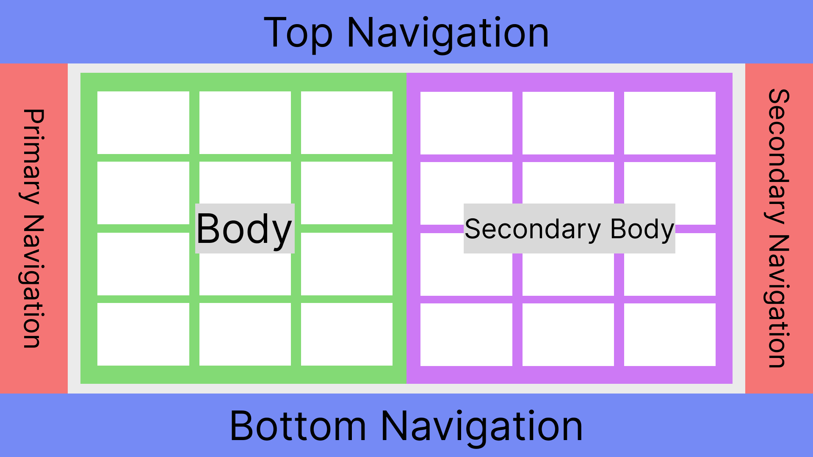

<?code-excerpt path-base="example/lib"?>

# Adaptive Scaffold

`AdaptiveScaffold` reacts to input from users, devices and screen elements and
renders your Flutter application according to the
[Material 3](https://m3.material.io/foundations/adaptive-design/overview)
guidelines.

To see examples of using these widgets to make a simple but common adaptive
layout:

```bash
cd example/
flutter run --release
```

## AdaptiveScaffold

AdaptiveScaffold implements the basic visual layout structure for Material
Design 3 that adapts to a variety of screens. It provides a preset of layout,
including positions and animations, by handling macro changes in navigational
elements and bodies based on the current features of the screen, namely screen
width and platform. For example, the navigational elements would be a
BottomNavigationBar on a small mobile device and a NavigationRail on larger
devices. The body is the primary screen that takes up the space left by the
navigational elements. The secondaryBody acts as an option to split the space
between two panes for purposes such as having a detail view. There is some
automatic functionality with foldables to handle the split between panels
properly. AdaptiveScaffold is much simpler to use but is not the best if you
would like high customizability. Apps that would like more refined layout and/or
animation should use AdaptiveLayout.

### Example Usage

<?code-excerpt "adaptive_scaffold_demo.dart (Example)"?>
```dart
@override
Widget build(BuildContext context) {
  // Define the children to display within the body at different breakpoints.
  final List<Widget> children = <Widget>[
    for (int i = 0; i < 10; i++)
      Padding(
        padding: const EdgeInsets.all(8.0),
        child: Container(
          color: const Color.fromARGB(255, 255, 201, 197),
          height: 400,
        ),
      )
  ];
  return AdaptiveScaffold(
    // An option to override the default transition duration.
    transitionDuration: Duration(milliseconds: _transitionDuration),
    // An option to override the default breakpoints used for small, medium,
    // and large.
    smallBreakpoint: const WidthPlatformBreakpoint(end: 700),
    mediumBreakpoint: const WidthPlatformBreakpoint(begin: 700, end: 1000),
    largeBreakpoint: const WidthPlatformBreakpoint(begin: 1000),
    useDrawer: false,
    selectedIndex: _selectedTab,
    onSelectedIndexChange: (int index) {
      setState(() {
        _selectedTab = index;
      });
    },
    destinations: const <NavigationDestination>[
      NavigationDestination(
        icon: Icon(Icons.inbox_outlined),
        selectedIcon: Icon(Icons.inbox),
        label: 'Inbox',
      ),
      NavigationDestination(
        icon: Icon(Icons.article_outlined),
        selectedIcon: Icon(Icons.article),
        label: 'Articles',
      ),
      NavigationDestination(
        icon: Icon(Icons.chat_outlined),
        selectedIcon: Icon(Icons.chat),
        label: 'Chat',
      ),
      NavigationDestination(
        icon: Icon(Icons.video_call_outlined),
        selectedIcon: Icon(Icons.video_call),
        label: 'Video',
      ),
      NavigationDestination(
        icon: Icon(Icons.home_outlined),
        selectedIcon: Icon(Icons.home),
        label: 'Inbox',
      ),
    ],
    body: (_) => GridView.count(crossAxisCount: 2, children: children),
    smallBody: (_) => ListView.builder(
      itemCount: children.length,
      itemBuilder: (_, int idx) => children[idx],
    ),
    // Define a default secondaryBody.
    secondaryBody: (_) => Container(
      color: const Color.fromARGB(255, 234, 158, 192),
    ),
    // Override the default secondaryBody during the smallBreakpoint to be
    // empty. Must use AdaptiveScaffold.emptyBuilder to ensure it is properly
    // overridden.
    smallSecondaryBody: AdaptiveScaffold.emptyBuilder,
  );
}
```

## The Background Widget Suite

These are the set of widgets that are used on a lower level and offer more
customizability at a cost of more lines of code.

### AdaptiveLayout


AdaptiveLayout is the top-level widget class that arranges the layout of the
slots and their animation, similar to Scaffold. It takes in several LayoutSlots
and returns an appropriate layout based on the diagram above. AdaptiveScaffold
is built upon AdaptiveLayout internally but abstracts some of the complexity
with presets based on the Material 3 Design specification.

### SlotLayout

SlotLayout handles the adaptivity or the changes between widgets at certain
Breakpoints. It also holds the logic for animating between breakpoints. It takes
SlotLayoutConfigs mapped to Breakpoints in a config and displays a widget based
on that information.

### SlotLayout.from

SlotLayout.from creates a SlotLayoutConfig holds the actual widget to be
displayed and the entrance animation and exit animation.

### Example Usage

<?code-excerpt "adaptive_layout_demo.dart (Example)"?>
```dart
// AdaptiveLayout has a number of slots that take SlotLayouts and these
// SlotLayouts' configs take maps of Breakpoints to SlotLayoutConfigs.
return AdaptiveLayout(
  // An option to override the default transition duration.
  transitionDuration: Duration(milliseconds: _transitionDuration),
  // Primary navigation config has nothing from 0 to 600 dp screen width,
  // then an unextended NavigationRail with no labels and just icons then an
  // extended NavigationRail with both icons and labels.
  primaryNavigation: SlotLayout(
    config: <Breakpoint, SlotLayoutConfig>{
      Breakpoints.medium: SlotLayout.from(
        inAnimation: AdaptiveScaffold.leftOutIn,
        key: const Key('Primary Navigation Medium'),
        builder: (_) => AdaptiveScaffold.standardNavigationRail(
          selectedIndex: selectedNavigation,
          onDestinationSelected: (int newIndex) {
            setState(() {
              selectedNavigation = newIndex;
            });
          },
          leading: const Icon(Icons.menu),
          destinations: destinations
              .map((NavigationDestination destination) =>
                  AdaptiveScaffold.toRailDestination(destination))
              .toList(),
          backgroundColor: navRailTheme.backgroundColor,
          selectedIconTheme: navRailTheme.selectedIconTheme,
          unselectedIconTheme: navRailTheme.unselectedIconTheme,
          selectedLabelTextStyle: navRailTheme.selectedLabelTextStyle,
          unSelectedLabelTextStyle: navRailTheme.unselectedLabelTextStyle,
        ),
      ),
      Breakpoints.large: SlotLayout.from(
        key: const Key('Primary Navigation Large'),
        inAnimation: AdaptiveScaffold.leftOutIn,
        builder: (_) => AdaptiveScaffold.standardNavigationRail(
          selectedIndex: selectedNavigation,
          onDestinationSelected: (int newIndex) {
            setState(() {
              selectedNavigation = newIndex;
            });
          },
          extended: true,
          leading: const Row(
            mainAxisAlignment: MainAxisAlignment.spaceAround,
            children: <Widget>[
              Text(
                'REPLY',
                style: TextStyle(color: Color.fromARGB(255, 255, 201, 197)),
              ),
              Icon(Icons.menu_open)
            ],
          ),
          destinations: destinations
              .map((NavigationDestination destination) =>
                  AdaptiveScaffold.toRailDestination(destination))
              .toList(),
          trailing: trailingNavRail,
          backgroundColor: navRailTheme.backgroundColor,
          selectedIconTheme: navRailTheme.selectedIconTheme,
          unselectedIconTheme: navRailTheme.unselectedIconTheme,
          selectedLabelTextStyle: navRailTheme.selectedLabelTextStyle,
          unSelectedLabelTextStyle: navRailTheme.unselectedLabelTextStyle,
        ),
      ),
    },
  ),
  // Body switches between a ListView and a GridView from small to medium
  // breakpoints and onwards.
  body: SlotLayout(
    config: <Breakpoint, SlotLayoutConfig>{
      Breakpoints.small: SlotLayout.from(
        key: const Key('Body Small'),
        builder: (_) => ListView.builder(
          itemCount: children.length,
          itemBuilder: (BuildContext context, int index) => children[index],
        ),
      ),
      Breakpoints.mediumAndUp: SlotLayout.from(
        key: const Key('Body Medium'),
        builder: (_) =>
            GridView.count(crossAxisCount: 2, children: children),
      )
    },
  ),
  // BottomNavigation is only active in small views defined as under 600 dp
  // width.
  bottomNavigation: SlotLayout(
    config: <Breakpoint, SlotLayoutConfig>{
      Breakpoints.small: SlotLayout.from(
        key: const Key('Bottom Navigation Small'),
        inAnimation: AdaptiveScaffold.bottomToTop,
        outAnimation: AdaptiveScaffold.topToBottom,
        builder: (_) => AdaptiveScaffold.standardBottomNavigationBar(
          destinations: destinations,
          currentIndex: selectedNavigation,
          onDestinationSelected: (int newIndex) {
            setState(() {
              selectedNavigation = newIndex;
            });
          },
        ),
      )
    },
  ),
);
```

Both of the examples shown here produce the same output:

