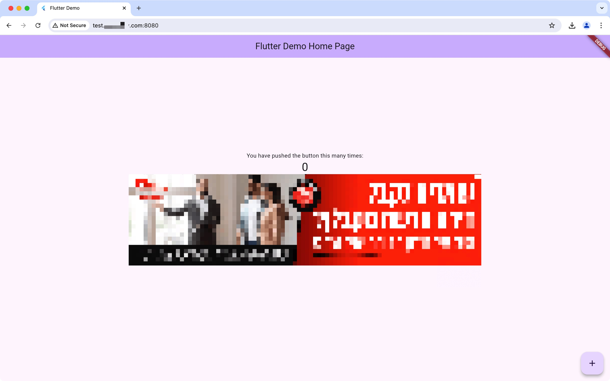

# google_adsense_example

An example demonstrating google_adsense Flutter plugin usage

## Screenshots

## Testing

This package uses `package:integration_test` to run its tests in a web browser.

See [Plugin Tests > Web Tests](https://github.com/flutter/flutter/blob/master/docs/ecosystem/testing/Plugin-Tests.md#web-tests)
in the Flutter documentation for instructions to set up and run the tests in this package.

Check [flutter.dev > Integration testing](https://docs.flutter.dev/testing/integration-tests)
for more info.

