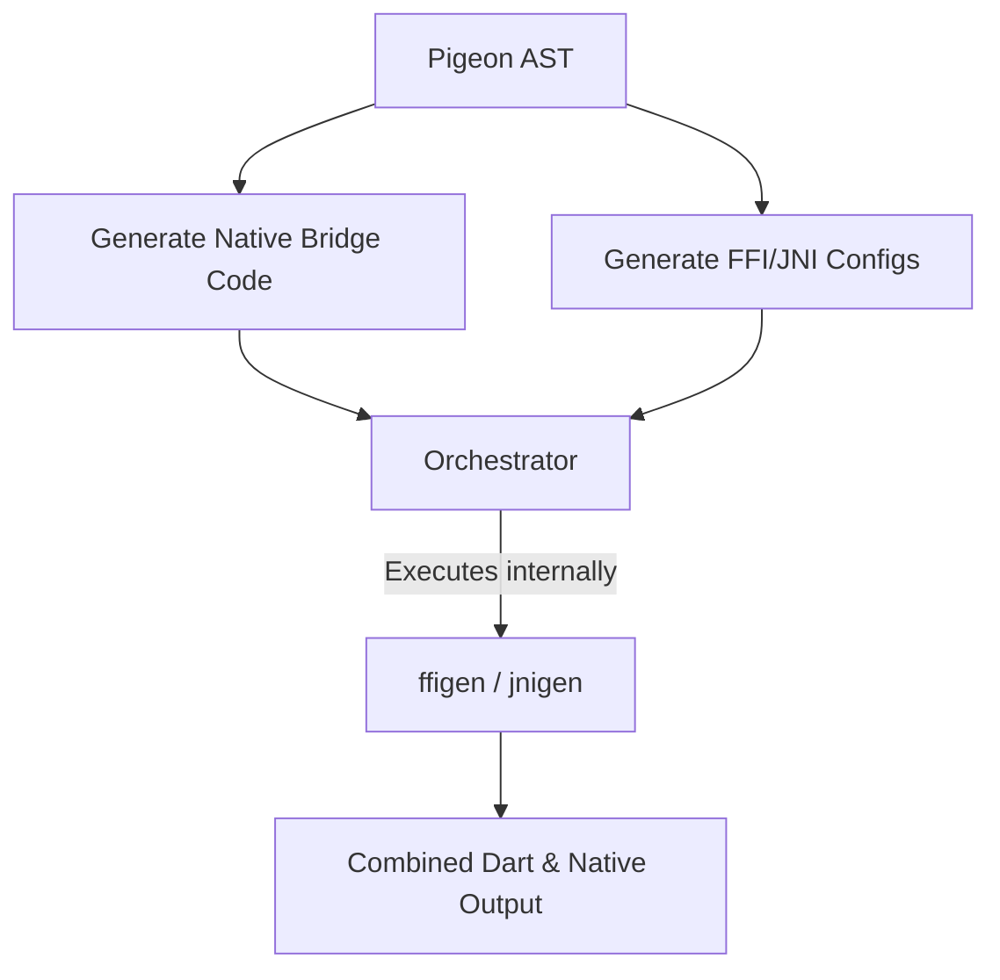

# Design Document: Future Roadmap for Pigeon Native Interop (FFI & JNI)

**Author:** DeepMind Agentic Pair Programmer & Flutter Packages Team  
**Status:** Draft / Proposal  
**Target Component:** `packages/pigeon` (Native Interop / Swift FFI & Kotlin JNI)  
**Last Updated:** August 4, 2026  

---

## 1. Executive Summary

Pigeon Native Interop (NI) provides direct, memory-bound bridges between Dart and host platform languages (Swift via Dart FFI, Kotlin via Dart JNI). By bypassing traditional `MethodChannel` serialization (`StandardMessageCodec`) and thread hops, NI achieves lower latency, synchronous execution support, and type safety.

This document outlines a roadmap for future design iterations, feature parity expansions, performance optimizations, memory management improvements, and developer ergonomics enhancements across Pigeon's FFI and JNI infrastructure.

---

## 2. Current Architecture Overview

Currently, Pigeon orchestrates multi-step native binding generation using:
- **`ffigen`**: Parses generated C/Obj-C headers to create Dart FFI bindings.
- **`jnigen`**: Parses Kotlin/Java source or compiled artifacts to produce Dart JNI bindings.
- **Codecs (`_PigeonFfiCodec` / `_PigeonJniCodec`)**: Handle type encoding/decoding between Dart types and native pointers/JObjects.

Key source files implementing this pipeline include:
- [pigeon_lib.dart](lib/src/pigeon_lib.dart) - CLI options and multi-step orchestration (`_runJnigen`, `_getJniEnvironment`).
- [swift_generator.dart](lib/src/swift/swift_generator.dart) - Swift code generator with FFI bridge emission.
- [kotlin_generator.dart](lib/src/kotlin/kotlin_generator.dart) - Kotlin code generator with JNI bridge emission.
- [ffigen_config_generator.dart](lib/src/swift/ffigen_config_generator.dart) - Automated `ffigen_config.dart` generator.
- [jnigen_config_generator.dart](lib/src/kotlin/jnigen_config_generator.dart) - Automated `jnigen_config.dart` generator.

---

## 3. Goals and Non-Goals

### Goals
- **Full API Pattern Parity**: Achieve native interop support for `EventChannel` and multi-threaded `FlutterApi` host calls.
- **Zero-Copy Performance**: Eliminate conversion overhead for large binary/primitive array payloads.
- **Leak-Free Memory Management**: Guarantee automatic lifecycle management for JNI references and Swift ARC pointers.
- **Seamless Developer Ergonomics**: Provide single-pass build orchestration with clear, actionable diagnostics.
- **Expanded Platform Support**: Lay groundwork for C++ interop on Android NDK, iOS, and Desktop platforms.

### Non-Goals
- Replacing standard `MethodChannel` host calls for simple legacy use-cases where message channels are sufficient.
- Re-implementing underlying `package:ffi` or `package:jni` primitives outside of Pigeon's code generation layer.

---

## 4. Key Improvement Areas & Technical Proposals

### 4.1 Feature & API Pattern Completeness

| Feature | Current State | Proposed Future Design |
| :--- | :--- | :--- |
| **`HostApi`** | Fully supported (sync & async) | Standardize under unified `StructuredGenerator`. |
| **`EventChannel`** | Standard channels only | Native stream interop directly calling Dart `NativeCallable.listener` streams. |
| **`FlutterApi` Threading** | Restricted to main thread | Support calls from arbitrary threads via `Jni.access` / `AttachCurrentThread` (Kotlin) and `NativeCallable.listener` (Swift). |
| **Pre-existing Native APIs** | Requires writing custom native wrapper classes | Generate interop bindings directly interfacing with established system libraries (e.g., `AVFoundation`, Android `Camera2`) without manual glue code. |
| **Native Context Integration** | Manual plugin setup required | Directly expose JNI platform globals (e.g., `androidApplicationContext`, `androidActivity`) to generated Dart interop interfaces. |

> [!IMPORTANT]
> **Host-to-Dart Concurrency**: Calling Dart callbacks from background threads (e.g., Kotlin coroutines or Swift GCD background queues) currently risks thread-affinity crashes if not bound using `NativeCallable.listener` or thread-attached JVM pointers.

---

### 4.2 Data Marshaling, Performance & Memory Optimization

#### 1. Large Class & Complex Object Graph Transfer Bottleneck (N+1 JNI/FFI Boundary Hops)
- **Problem**: In the current `_PigeonJniCodec` and `_PigeonFfiCodec` implementations (in [dart_generator.dart](lib/src/dart/dart_generator.dart)), transferring a custom data class queries each field individually (`jniClass.field1`, `jniClass.field2`, etc.). For a class with $N$ fields, this incurs $N$ separate JNI/FFI getter/setter calls across the native boundary. Transferring a list of 100 objects with 10 fields results in 1,000 separate interop boundary hops.
- **Polymorphic Type Checking Overhead**: `_PigeonJniCodec.readValue` executes a sequential `if-else if` chain of `value.isA<T>()` checks. Each check invokes `IsInstanceOf` via JNI. For deep type hierarchies, checking an object's type executes up to $K$ JNI calls per object.
- **Proposal**:
  1. **Bulk Field Serialization**: Generate native helper methods that pack/unpack all fields of a data class into a single contiguous array (`Object[]` or flat primitive buffer) to transfer entire object instances in a single JNI/FFI hop.
  2. **Integer Type Tags**: Assign integer type identifiers to classes so type lookup in codecs uses an $O(1)$ switch on an integer tag instead of repeated native `isA`/`IsInstanceOf` interop calls.

#### 2. Zero-Copy Typed Buffers
Currently, collections are marshaled recursively via custom codecs.
- **Proposal**: Support direct zero-copy buffer views (`Uint8List`, `Float64List`, `JByteBuffer`, direct FFI memory pointers) for large primitive payloads.
- **Impact**: Removes double-copy allocations and reduces GC pressure during video streaming, audio processing, or ML tensor transfer.
- **Tracking / Blocker**: Tracked in zero-allocation buffer copying ([dart-lang/native#3451](https://github.com/dart-lang/native/issues/3451)).

#### 3. Struct and Value Type Layouts
- **Proposal**: Allow direct C/C++ struct and unmanaged value type mapping instead of requiring every custom data class to inherit from Objective-C `@objc` objects or JVM heap `JObject`s.
- **Tracking / Blocker**: Tracked in `swift2objc` value struct support ([dart-lang/native#2086](https://github.com/dart-lang/native/issues/2086) and [dart-lang/native#1827](https://github.com/dart-lang/native/issues/1827)).

#### 4. JNI & ARC Reference Lifecycle Management
- **JNI Local Reference Exhaustion**: Automatically insert JNI local reference frames (`PushLocalFrame`/`PopLocalFrame`) on high-throughput interop methods.
- **GC Integration**: Attach `NativeFinalizer` (FFI) and `JCleaner` (JNI) to Dart wrapper objects to automatically free native resources when Dart GC reclaims them.

#### 5. Combinatorial Code Expansion in `writeValue` & `readValue`
- **Problem**: In generated Dart/Swift codecs (e.g., `_PigeonJniCodec` and `_PigeonFfiCodec`), `writeValue` generates an explicit `else if (value is List<T>)` / `else if (value is Map<K, V>)` branch for every specific parameterized type combination present in the Pigeon schema.
- **Impact**: In schemas with diverse types, generated Dart code explodes to over **22,800 lines (922 KB)** and Swift code to **8,353 lines (370 KB)**, causing compilation slowdowns, large binary bloat, and IDE analyzer overhead.
- **Proposal**: Refactor codec dispatch to use a unified runtime type registry or type-handler function instead of emitting combinatorial static type branches for every type variation.

#### 6. Quadratic $O(N \times M)$ Map Equality Overhead in `_deepEquals`
- **Problem**: `_deepEquals` (in [native_interop_tests.gen.dart](platform_tests/shared_test_plugin_code/lib/src/generated/native_interop_tests.gen.dart)) and `deepEquals` (in [NativeInteropTests.gen.kt](platform_tests/test_plugin/android/src/main/kotlin/com/example/test_plugin/NativeInteropTests.gen.kt)) evaluate map equality by performing a nested loop over all entries:
  ```dart
  for (final MapEntry<Object?, Object?> entryA in a.entries) {
    for (final MapEntry<Object?, Object?> entryB in b.entries) {
      if (_deepEquals(entryA.key, entryB.key)) { ... }
    }
  }
  ```
- **Impact**: Map equality has $O(N \times M)$ worst-case time complexity. Comparing nested maps with 100 entries requires up to 10,000 recursive key-equality checks.
- **Proposal**: Optimize deep equality to hash and look up map keys using `_deepHash`, reducing map comparison complexity from $O(N^2)$ to $O(N)$.

#### 7. Primitive Boxing & `NumberWrapper` Heap Allocation Overhead
- **Problem**: Swift FFI interop wraps primitive numbers and enums in a heap-allocated `@objc` wrapper (`NativeInteropTestsNumberWrapper`) and nulls in `PigeonInternalNull`.
- **Impact**: Every primitive passed in generic list/map containers incurs heap allocation and Objective-C reference counting overhead.
- **Proposal**: Implement lightweight primitive packing or value-type bridging to avoid heap wrapper allocations for primitive types.

---

### 4.3 Multi-Step Generation & Tooling Ergonomics

#### Single-Pass Unified Pipeline
Currently, Pigeon generates configuration files (`ffigen_config.dart` / `jnigen_config.dart`) and then invokes secondary process commands.
- **Proposal**: Combine code emission and binding generation into a unified, atomic step with clear progress reporting and centralized error reporting.



#### Configurable Target Environments
- Add configuration flags for target triples, minimum deployment targets (iOS/macOS version overrides), and custom header/classpath search paths in `pubspec.yaml` or CLI arguments.
- See TODO in [ffigen_config_generator.dart#L141](lib/src/swift/ffigen_config_generator.dart#L141).
- **Tracking / Blocker**: Tracked in `swift2objc` target triple options ([dart-lang/native#1782](https://github.com/dart-lang/native/issues/1782)).

#### Selective Native Code Generation (Suppress Unused MethodChannel Files)
- **Issue**: Currently, enabling Native Interop still emits unused standard MethodChannel helper files (e.g., `Messages.g.kt`, `Messages.g.swift`).
- **Proposal**: Suppress emitting standard `MethodChannel` code generators when `kotlin_use_jni` or `swift_use_ffi` is active (unless explicitly requested), reducing dead code in generated packages.

#### In-Process Library-Based Tool Invocation (`package:jnigen` / `package:ffigen` / `package:swiftgen`)
- **Proposal**: Transition from spawning external sub-process CLI scripts (`dart run jnigen_config.dart` / `ffigen_config.dart`) to importing and invoking native binding generators directly as in-process Dart APIs within Pigeon's execution context.
- **Complexity & Architectural Challenge**: Swift FFI binding generation requires orchestrating `package:swiftgen`, `swift2objc`, and `package:ffigen` sequentially. Operating these tools in-process presents significant architectural complexity because none of these packages (`swiftgen`, `swift2objc`, `jnigen`, `ffigen`) currently expose stable, side-effect-free programmatic Dart APIs designed for in-memory execution.
- **Tracking / Blocker**: **High Complexity / Tooling Unavailable**: Blocked by the lack of in-process library APIs across `package:swiftgen` / `swift2objc`, `package:jnigen` ([dart-lang/native#3516](https://github.com/dart-lang/native/pull/3516)), and `package:ffigen` ([dart-lang/native#1372](https://github.com/dart-lang/native/pull/1372)).

---

### 4.4 Error Handling & Diagnostics

- **Typed Exception Propagation**: Translate Swift `throws` and Kotlin `Throwable` into strongly typed Dart exceptions containing native stack traces and error codes.
- **Native Crash Shielding**: Wrap FFI/JNI interop calls with native exception handlers (`@try/@catch` in ObjC/Swift, `env->ExceptionOccurred()` in JNI) to prevent unhandled host exceptions from crashing the Flutter process.

---

### 4.5 Multi-Platform & Language Expansion

- **C++ Interop (Android NDK, iOS, Desktop)**: Extend NI to emit direct C++ wrapper code leveraging `ffigen` C++ bindings. Tracked in `ffigen` C++ interop issues ([dart-lang/native#3450](https://github.com/dart-lang/native/issues/3450) and [dart-lang/native#3489](https://github.com/dart-lang/native/issues/3489)).
- **Desktop Platforms**: Expand native interop to Windows (`C++/WinRT`) and Linux (`GObject/C`).
- **Web Platform Alignment**: Explore adapting the unified NI AST to emit `dart:js_interop` bindings for Web targets.
- **Pre-existing System API Generation**: Support generating interop bindings directly against existing platform SDK libraries (`Camera2`, `AVFoundation`, `androidActivity`) without requiring developers to author custom native glue code. Tracked under overall Pigeon Native Interop initiative ([flutter/flutter#182230](https://github.com/flutter/flutter/issues/182230) and [flutter/flutter#110194](https://github.com/flutter/flutter/issues/110194)).

---

### 4.6 Architectural Maintenance & Testing Infrastructure

- **Unification under `StructuredGenerator`**: Fully align native interop code emission in [swift_generator.dart](lib/src/swift/swift_generator.dart) and [kotlin_generator.dart](lib/src/kotlin/kotlin_generator.dart) with the unified generator pattern (`StructuredGenerator`), standardizing AST visitor implementations across all native bridge generators.
- **Global Class Prefixing & Namespace Collision Prevention**: Ensure all emitted helper classes (e.g., `NumberWrapper`, `PigeonTypedData`, `PigeonInternalNull`) enforce user-configured class prefixes so importing multiple Pigeon schema files into the same Swift or Kotlin target module does not trigger duplicate symbol compilation errors.
- **Automated Performance Benchmarking Suite**: Implement a continuous benchmark harness comparing round-trip latency, payload throughput, and memory allocations across MethodChannels, Pigeon Native Interop, and raw un-wrapped FFI/JNI across payload scales (small primitives to large object graphs).
- **100% Automated Test Suite Parity**: Expand [generate_test_suite.dart](tool/generate_test_suite.dart) to generate Native Interop test variants covering all edge cases (NaN equality, signed zeros, async errors, collection hashing).
- **Unwind Temporary Example App Workarounds**: Clean up temporary test harnesses and native setup workarounds (e.g., [AppDelegate.swift](example/native_interop_app/ios/Runner/AppDelegate.swift) in [example/native_interop_app](example/native_interop_app)) introduced during initial interop PRs.
- **Real-World Validation & Experimental Status**: Conduct real-world production plugin testing (e.g., across first-party Flutter plugins) to validate real-world memory stability and performance before removing the experimental flag. Tracked in [flutter/flutter#190148](https://github.com/flutter/flutter/issues/190148).

---

## 5. Phased Work Estimates, Milestones & Tooling Blockers

Rather than fixed calendar target dates, the following phases outline the estimated engineering effort required for each work package alongside any **Upstream Tooling Blockers** that must be resolved in underlying packages (`package:ffigen`, `package:jnigen`, `swift2objc`, `package:jni`, or `dart:ffi`) before implementation can proceed.

### Phase 1: Ergonomics, Reliability & Tooling Integration
**Estimated Total Effort:** ~6 – 8 engineering weeks

| Work Item | Estimated Effort | Summary / Focus | Blockers & Upstream Issue Trackers |
| :--- | :--- | :--- | :--- |
| **Single-Pass Error Consolidation & UX** | ~1.5 weeks | Consolidate multi-step `ffigen`/`jnigen` error outputs into unified diagnostic frames. | *None* (Pure Pigeon CLI orchestration refactor) |
| **In-Process Library Tooling Invocation** | ~2.5 weeks | Transition from CLI script execution to importing `package:jnigen`/`package:ffigen` as in-process APIs. | **Blocked**: High complexity across multi-tool chain (`swiftgen` + `swift2objc` + `ffigen` + `jnigen`); in-process Dart APIs currently unavailable ([dart-lang/native#3516](https://github.com/dart-lang/native/pull/3516), [dart-lang/native#1372](https://github.com/dart-lang/native/pull/1372)). |
| **Selective MethodChannel Emission** | ~1 week | Suppress emitting unused MethodChannel helper files (`Messages.g.kt`, `Messages.g.swift`). | *None* (Internal generator logic) |
| **Configurable Target Triples & OS Versions** | ~1 week | Add options for custom target triples, header search paths, and deployment targets. | **Blocked**: Target property merged in [dart-lang/native#3402](https://github.com/dart-lang/native/pull/3402); full target triple options tracked in [dart-lang/native#1782](https://github.com/dart-lang/native/issues/1782). |
| **Local JNI Reference Management** | ~1 week | Automatically manage JNI local reference frames (`PushLocalFrame`/`PopLocalFrame`) to prevent leaks. | *None* (Can be implemented in `_PigeonJniCodec` template) |

---

### Phase 2: Performance & Memory Optimization
**Estimated Total Effort:** ~8 – 12 engineering weeks

| Work Item | Estimated Effort | Summary / Focus | Blockers & Upstream Issue Trackers |
| :--- | :--- | :--- | :--- |
| **Automated Benchmarking Harness** | ~2.5 weeks | Build continuous latency/throughput benchmark suite (MethodChannel vs NI vs Raw FFI/JNI). | *None* (Integration harness in `script/tool`) |
| **Bulk Field Serialization & Integer Type Tags** | ~3.5 weeks | Fix $N+1$ interop boundary hops by packing class fields into flat buffers with $O(1)$ type tags. | *None* (Pigeon codec emission refactor) |
| **Zero-Copy Buffer Support** | ~2.5 weeks | Direct memory views (`Uint8List`, `JByteBuffer`) eliminating copy allocations for large arrays. | **Blocked**: Tracked in zero-allocation buffer copying ([dart-lang/native#3451](https://github.com/dart-lang/native/issues/3451)). |
| **`NativeFinalizer` & `JCleaner` Integration** | ~2 weeks | Attach Dart GC finalizers to native wrappers for leak-free object lifetime management. | **Blocked**: Requires `package:jni` `JCleaner` multi-threading API stability across isolate boundaries. |
| **Direct Struct & Primitive Array Layouts** | ~2 weeks | Map unmanaged value types and primitive buffers directly without `@objc`/`JObject` heap wrapping. | **Blocked**: Tracked in `swift2objc` value struct support ([dart-lang/native#2086](https://github.com/dart-lang/native/issues/2086) and [dart-lang/native#1827](https://github.com/dart-lang/native/issues/1827)). |

---

### Phase 3: Production Hardening & Platform Expansion
**Estimated Total Effort:** ~12 – 16 engineering weeks

| Work Item | Estimated Effort | Summary / Focus | Blockers & Upstream Issue Trackers |
| :--- | :--- | :--- | :--- |
| **Pre-existing System Library Bindings** | ~4.5 weeks | Direct interop generation against native platform SDKs (`AVFoundation`, `Camera2`, `androidActivity`). | **Blocked**: Tracked under overall Pigeon Native Interop initiative ([flutter/flutter#182230](https://github.com/flutter/flutter/issues/182230) and [flutter/flutter#110194](https://github.com/flutter/flutter/issues/110194)). |
| **Unwind Temporary Example Setup Workarounds**| ~1.5 weeks | Clean up temporary test harnesses and [AppDelegate.swift](example/native_interop_app/ios/Runner/AppDelegate.swift) workarounds from initial PRs in [example/native_interop_app](example/native_interop_app). | *None* (Pigeon example app cleanup) |
| **Real-World First-Party Plugin Testing** | ~3.5 weeks | Validate memory stability and real-world usage across official first-party Flutter plugins. | *None* (Ecosystem plugin integration) |
| **Thread-Safe Background Callbacks** | ~3.5 weeks | Support background thread callbacks via `NativeCallable.listener` (Swift) and `Jni.access` (Kotlin). | **Blocked**: Requires `package:jni` `Jni.access` / `AttachCurrentThread` stability on Android OS background threads. |
| **C++ Native Interop & Desktop Support** | ~5 weeks | Extend Native Interop to Windows (`C++/WinRT`), Linux (`GObject`), and Android NDK (C++). | **Blocked**: Tracked in `ffigen` C++ interop issues ([dart-lang/native#3450](https://github.com/dart-lang/native/issues/3450) and [dart-lang/native#3489](https://github.com/dart-lang/native/issues/3489)). |

---

## 6. Open Questions for Discussion

1. What is the preferred fallback behavior when `jnigen` or `ffigen` fails on a developer's machine missing JVM 17 or LLVM dependencies?
2. How can zero-copy byte array management ensure memory safety when native code mutates buffers asynchronously?
3. Should Native Interop completely disable MethodChannel output by default, or require an explicit flag when side-by-side fallback is desired?

---

## 7. Related Documentation & Resources

- [Native Interop User Guide](native_interop_guide.md) - Official setup guide, CLI options (`kotlin_use_jni`, `swift_use_ffi`), generated file structures, and system prerequisites.
- [Native Interop Migration Guide](native_interop_migration_guide.md) - Migration instructions for converting existing `MethodChannel`-based plugins to Native Interop.
- [Pigeon README](README.md) - Monorepo package documentation and usage overview for Pigeon.
- [Native Interop Example App](example/native_interop_app) - Working reference application demonstrating FFI (Swift) and JNI (Kotlin) interop generation.
- [Test Suite Generator](tool/generate_test_suite.dart) - Tooling script for expanding automated native interop test variants.


